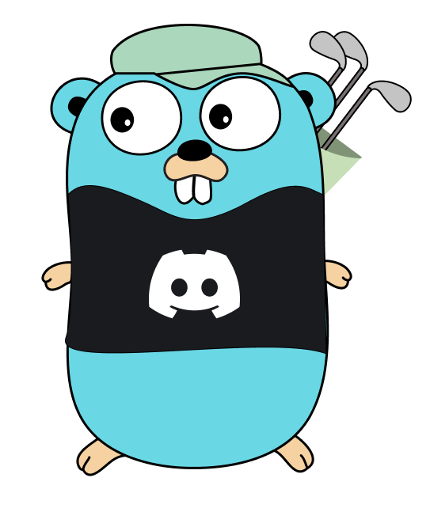

<div align="center">


</div>
<div align="center"><h2>Make Discord bots on Go with ease</h2></div>


## About
Disgolf is lightweight <a href="https://go.dev">Go</a> framework for building bots on Discord.<br/>It does all complicated things for you, keeping your code clean and helps you focus on important stuff.

## Installation
To install the library you must have at least Go of version 1.15 and use `master` version of DiscordGo, otherwise you will end up with a lot of errors.
And that's not good.
```bash
$ go get -u github.com/FedorLap2006/disgolf
```

## Usage
> For complicated usage examples you can visit our [examples](https://github.com/FedorLap2006/disgolf/tree/master/examples) directory.

```go
package main

import (
    "os"
    "signal"
    "syscall"
    "time"

    "github.com/FedorLap2006/disgolf"
    "github.com/bwmarrin/discordgo"
)

func main() {
    bot, err := disgolf.New("BOT-TOKEN")
    if err != nil {
        panic(err)
    }

    bot.Router.Register(&disgolf.Command{
        Name: "hello_world",
        Description: "Say hi to the world!",
        Handler: disgolf.CommandHandlerFunc(func(ctx *disgolf.Ctx) error {
            ctx.Respond(&discordgo.InteractionResponse {
                Type: discordgo.InteractionResponseChannelMessageWithSource,
                Data: &discordgo.InteractionResponseData{
                    Content: "Hello world!",
                },
            })
        })
    })

    err := bot.Router.Sync(bot.Session, "", "GUILD-TEST-ID")
    if err != nil {
        panic(err)
    }

    err := bot.Open()
    if err != nil {
        panic(err)
    }
    defer bot.Close()
    
    stchan := make(chan os.Signal, 1)
    signal.Notify(stchan, syscall.SIGTERM, os.Interrupt, syscall.SIGSEGV)
end:
	for {
		select {
		case <-stchan:
			break end
		default:
		}
		time.Sleep(time.Second)
	}
}

```
